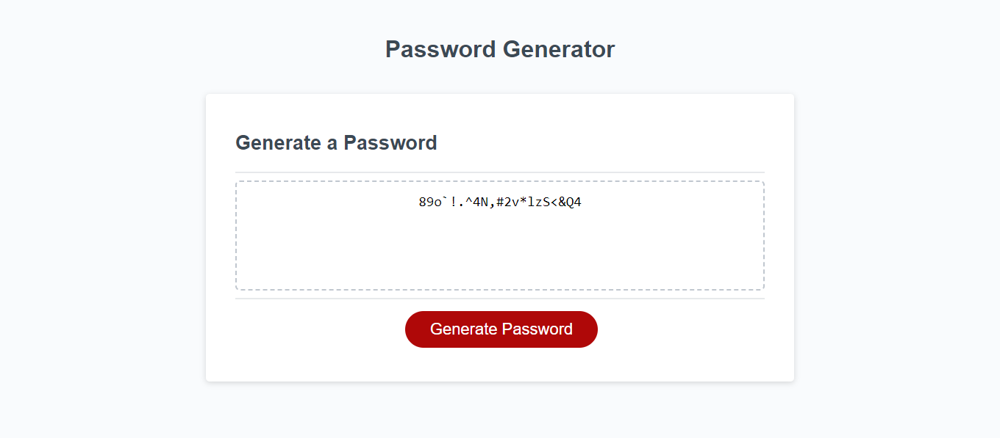

# Javascript Password Generator

## Description
This webpage was created to generate unique and random passwords that match the parameters set by the user. It satisfies all of the criteria for the University of Utah's Coding Bootcamp Module 3 Challenge. 

## Installation
N/A

## Usage
To use this webpage, answer the window prompts to generate a password to your liking. Also, open the DevTools by pressing Command+Option+I (macOS) or Control+Shift+I (Windows). Navigate to the console panel to see confirmation messages regarding the password.

## Deployment Link
[Password Generator](https://connorspendlove.github.io/Password-Generator/)
## Screenshot

## Credits
Starter code obtained through the University of Utah Coding Bootcamp.
| OWASP Foundation. (n.d.). https://owasp.org/www-community/password-special-characters

## License
Please refer to the LICENSE in the repository.
